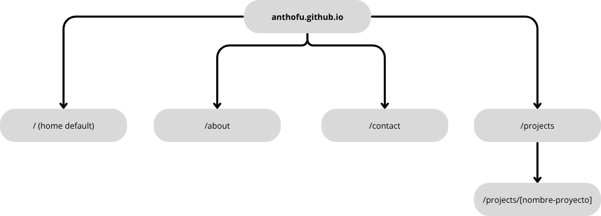

# Fase 1: Arquitectura del Sitio (Sitemap)

*Última actualización: 22/06/2025*

Este documento define la estructura de páginas (sitemap) para el portfolio. Se ha optado por una estructura simple y estándar para garantizar una navegación clara y una experiencia de usuario intuitiva.

## Diagrama del Sitemap

A continuación se muestra el flujo de navegación principal del sitio:

## Rutas Definidas

*   `/`: Página de inicio (Home).
*   `/about`: Página "Sobre Mí".
*   `/projects`: Galería principal de proyectos.
*   `/projects/[slug]`: Página de detalle para un proyecto específico (ruta dinámica).
*   `/contact`: Página de contacto.