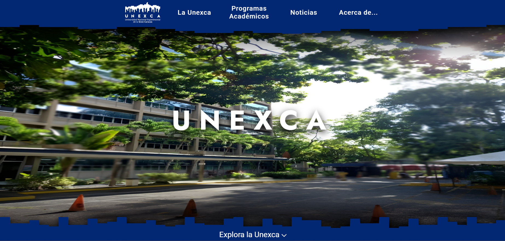
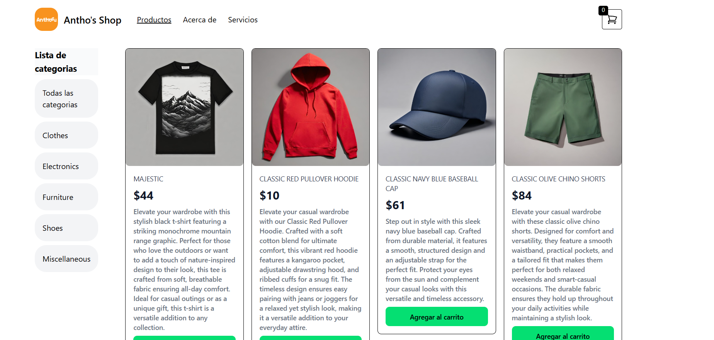
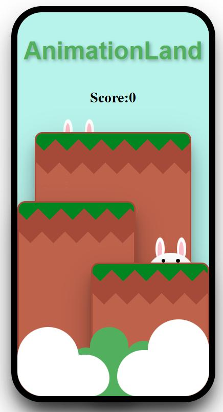

# Fase 1: Inventario de Contenido

*Última actualización: 22/06/2025*

Este documento es el inventario central de todo el contenido (textos, imágenes, enlaces) necesario para cada página del portfolio. Sirve como fuente de verdad para las fases de diseño y desarrollo.

---

## Página: `/` (Inicio / Home)

**Objetivo:** Captar la atención en 5 segundos, presentar mi propuesta de valor y guiar al usuario hacia mis proyectos.

### Bloque 1: Hero Section
- [x] **Titular Principal:** "Desarrollador Frontend enfocado en limpieza, eficiencia y diseño funcional."
- [x] **Subtítulo:** "Especializado en Angular y obsesionado con el detalle."
- [x] **Llamado a la Acción (CTA) Principal:** Botón con texto "Ver mis proyectos".

### Bloque 2: Proyectos Destacados
- [x] **Título de la sección:** "Algunos de mis proyectos"
- **Contenido:**
  - **Proyecto 1: Página Web Oficial de la UNEXCA** 🏛️🎓
    - **Imagen:** 
    - **Enlace:** [Página en desarrollo](https://unexca-website.netlify.app)
  - **Proyecto 2: AnthoFu's E-Commerce** 🛍️🛒
    - **Imagen:** 
    - **Enlace:** [Repositorio en GitHub](https://github.com/AnthoFu/Angular-17-Platzi)
  - **Proyecto 3: AnimationLand** 🐇🎮
    - **Imagen:** 
    - **Enlace:** [Repositorio en GitHub](https://github.com/AnthoFu/bunny-animations)

### Bloque 3: Llamado a la Acción Secundario
- [x] **Texto:** "¿Te gusta lo que ves? Hablemos de cómo puedo ayudarte."
- [x] **Botón:** Texto "Contactar".

---

## Página: `/about` (Sobre Mí)

**Objetivo:** Contar mi historia, mostrar mi personalidad y listar mis habilidades técnicas de forma clara.

### Bloque 1: Introducción Personal
- [ ] **Fotografía:** Necesito conseguir una foto profesional pero accesible.
- [x] **Párrafo Narrativo:** "Hola, soy Anthony Fuentes (AnthoFu). Desde pequeño me ha gustado ver código, la primera vez que manipulé uno fue con el 'inspeccionar' de Chrome en una pagina de juegos online. Intenté cambiar la cantidad de dinero de una moneda virtual que tenía la página pero nunca se guardaba, jajaja. Me gusta mucho la tecnología; ser capaz de crear cualquier cosa mediante código es emocionante, y la sensación de ver una app web en producción o que la gente utilice un programa que he hecho es increíble. ♥️"

### Bloque 2: Habilidades (Skills)
- [x] **Título de la sección:** "Habilidades Técnicas"
- [x] **Lista de Habilidades:**
  - **Lenguajes:** Python, HTML5, CSS, JavaScript, PHP.
  - **Frameworks:** Angular, React, Jupyter, TailwindCSS.
  - **Herramientas y Plataformas:** Git, GitHub, Jira, Firebase, Vercel, Netlify, Canva, Miro.

### Bloque 3: Experiencia y CV
- [x] **Experiencia Laboral:**
  - **Cargo:** Desarrollador de Tecnologías de Información
  - **Empresa:** Canguro
  - **Periodo:** Noviembre 2023 - Actualidad
  - **Descripción:** "Trabajando en una de las mayores empresas de venta de accesorios tecnológicos de Venezuela. Mis responsabilidades incluyen:"
    - Desarrollo de aplicaciones web.
    - Administración de bases de datos.
    - Manejo de automatizaciones con AWS Lambda.
    - Mantenimiento de aplicaciones existentes.
    - Colaboración en la migración del ERP de Odoo 15 a Odoo 17.
    - Creación de reglas de automatización en Odoo.
    - Gestión de permisos y roles para usuarios en Odoo 17.
- [ ] **Botón:** "Descargar mi CV" (necesito preparar el archivo PDF).

---

## Página: `/projects` (Galería de Proyectos)

**Objetivo:** Mostrar un resumen visual de todos mis proyectos.

### Bloque 1: Título e Introducción
- [x] **Título:** "Mis Proyectos"
- [x] **Párrafo corto:** "Aquí hay una selección de proyectos en los que he trabajado. Cada uno fue un desafío único y una oportunidad para aprender."

### Bloque 2: Galería de Proyectos
- [ ] **Definir la "Tarjeta de Proyecto" para cada uno de los 4 proyectos seleccionados.** Cada tarjeta debe contener:
  - Una imagen principal o GIF.
  - Título del proyecto.
  - Resumen de 1-2 frases.
  - Lista de 2-3 tecnologías clave (ej: `Angular`, `Firebase`, `TailwindCSS`).

---

## Página: `/projects/[nombre-proyecto]` (Detalle de Proyecto)

**Objetivo:** Profundizar en un proyecto específico.

- [ ] **Tarea Pendiente:** Rellenar la siguiente plantilla para cada uno de los 4 proyectos.

```markdown
### Título del Proyecto: [Nombre del Proyecto]
*   **Subtítulo:** [Resumen de 1 frase del proyecto]
*   **Enlaces:** [Live Demo] | [Repositorio]
*   **El Desafío:** [¿Qué problema había que resolver?]
*   **Mi Solución:** [¿Cómo lo resolví? ¿Qué decisiones técnicas tomé?]
*   **Mi Rol:** [¿Qué hice yo exactamente?]
*   **Stack Tecnológico:** [Lista detallada]
*   **Galería Visual:** [Necesito 2-4 imágenes/GIFs]
*   **Aprendizajes:** [¿Qué aprendí en este proyecto?]
```